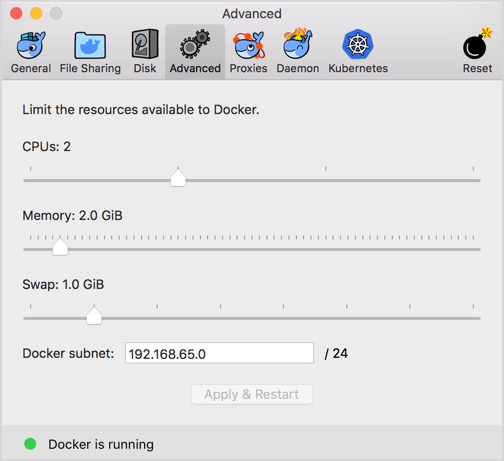
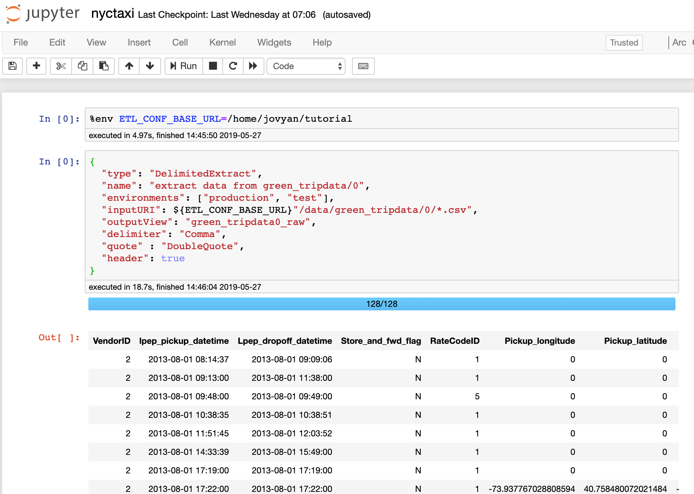

# Arc Starter

A starter project to begin coding an [Arc](https://github.com/tripl-ai/arc) job using the Jupyter Notebook interface see: [Arc-Jupyter](https://github.com/tripl-ai/arc-jupyter).

## Running

Clone this repository then run the included shells script. The user interface will then be available at http://localhost:8888 and the token will be printed to the console.

```bash
./.develop.sh
```

The `.develop.sh` script contains a hard coded memory allocation for [Apache Spark](https://spark.apache.org/) via the Java Virtual Machine which should be configured for your specific environment. e.g. to change from 4 Gigabytes to 8 Gigabytes:

```bash
-e JAVA_OPTS="-Xmx4g" \
```

to 

```bash
-e JAVA_OPTS="-Xmx8g" \
```

## Capabilities

| Magic          | Description                                                                                | Scala 2.11 | Scala 2.12 | numRows | truncate | outputView |
|----------------|--------------------------------------------------------------------------------------------|------------|------------|---------|----------|------------|
| %arc           | Execute an Arc stage. Default.                                                             | ✔          | ✔          | ✔       | ✔        | ✔          |
| %conf          | Set configuration. Default `master=local[*]`, `numRows=20`, `truncate=50`                  | ✔          | ✔          |         |          |            |
| %cypher        | Execute a Cypher query and return resultset.                                               |            | ✔          | ✔       | ✔        | ✔          |
| %env           | Set job variables via the notebook (e.g. `%env ETL_CONF_KEY0=value0 ETL_CONF_KEY1=value1`). Note these are not environment variables so `bash` interpretation (e.g. `$(date "+%Y-%m-%d")`) cannot be used. | ✔          | ✔          |         |          |            |
| %metadata      | Returns the metadata of an input view as a resultset.                                      | ✔          | ✔          | ✔       | ✔        | ✔          |
| %printmetadata | Prints the Arc metadata JSON for the input view.                                           | ✔          | ✔          |         |          |            |
| %printschema   | Prints the Spark schema for the input view as text.                                        | ✔          | ✔          |         |          |            |
| %schema        | Prints the Spark schema for the input view.                                                | ✔          | ✔          |         |          |            |
| %sql           | Execute a SQL query and return resultset.                                                  | ✔          | ✔          | ✔       | ✔        | ✔          |
| %sqlvalidate   | Execute a SQL query as a SQLValidate stage                                                 | ✔          | ✔          | ✔       | ✔        | ✔          |
| %summary       | Returns the summary statistics of an input view as resultset.                              | ✔          | ✔          | ✔       | ✔        | ✔          |
| %version       | Prints the version information of Arc Jupyter.                                             | ✔          | ✔          |         |          |            |


- `numRows` defines the number of rows to return in a result table.
- `truncate` defines the maximum number of characters displayed in a single result cell.
- `outputView` defines the name of a temporary view to register of the resultset.
- `persist` will persist the dataset in memory to speed up use.

### Example

This example shows how to use the `numRows`, `truncate`, `outputView` and `persist` options:

```sql
%sql numRows=10 truncate=100 outputView=green_tripdata0 persist=true
SELECT * 
FROM green_tripdata0_raw
WHERE fare_amount < 10
```

### Magics

These magics can be used to create 'inline SQL' statements that are executed as part of an Arc job.

#### SQLTransform

```sql
%sql name="sqltransform" description="description" environments=production,test outputView=example persist=true sqlParams=inputView=customer,inputField=id
SELECT
    ${inputField}
FROM ${inputView}
```

#### SQLValidate

```sql
%sqlvaildate name="name" description="description" environments=production,test sqlParams=inputView=customer,inputField=id
SELECT
    ${inputField} = 1 AS valid,
    "" AS message
FROM ${inputView}
```

## Exporting

In addition to executing the `.ipynb` file directly an Arc job export option has been provided in the `File\Download as` menu which will export all the Arc stages from the notebook and create a job file. Note that Jupyter Notebooks has been modified so that the `.ipynb` file will not save any `output` datasets to prevent data from being accidentally committed to version control.


## Issues

**Important:**

If you are running [Docker For Mac](https://docs.docker.com/docker-for-mac/) or [Docker for Windows](https://docs.docker.com/docker-for-windows/) ensure that the Docker memory allocation is large enough to support the memory `-Xmx4g` requested:




## Screenshot



## License

Arc is released under the [MIT License](https://opensource.org/licenses/MIT).
